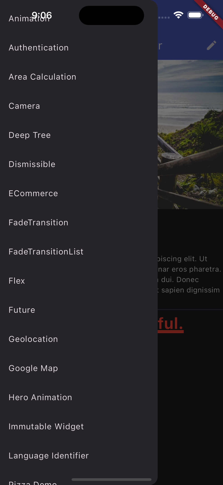

<a name="top"></a>

<div style="text-align: center;">
  <h3>flutter sandbox</h3>

  <p>
    Playground to learn flutter and dart.
  </p>
</div>

## About The Project

<div style="text-align: center;">
  
</div>

Based from [Flutter Cookbook - Second Edition][Book] by Simone Alessandria

### Built With

- [![Flutter][Shield]][Lang]

## Getting Started

Below is instructions on setting up your project locally on MacOS.
To get a local copy up and running follow these simple steps.

### Prerequisites

- Install Flutter SDK
  - See [official guide](https://docs.flutter.dev/get-started/install)
- Copy `.env_template` into `.env`
- Setup firebase via terraform

  - Requires to authenticate via google-cloud-sdk (`brew install google-cloud-sdk`)

    ```
    // Initialize backend (gcs)
    terraform init

    // plan and apply
    // Recommended to make .tfvars file for secret
    terraform plan --var-file some_secret.tfvars
    terraform apply --var-file some_secret.tfvars
    ```

- Run `flutterfire configure` to use firebase with flutterfire
  - See [official guide](https://firebase.google.com/docs/flutter/setup?platform=ios)

#### Note

- Some terraform config is either incomplete or only for testing, thus **should not be used for production**.
- Only works for iOS.

## Roadmap

- None

## License

Distributed under the MIT License.

<div style="text-align: right;">
  <p><a href="#top">↑ Back to top</a></p>
</div>

[project-screenshot]: ./screenshot.png
[Lang]: https://flutter.dev/
[Shield]: https://img.shields.io/badge/Flutter-v3.16.8-%230553B1.svg?style=for-the-badge&logo=Flutter&logoColor=white&labelColor=042B59
[Book]: https://www.packtpub.com/product/flutter-cookbook-second-edition-second-edition/9781803245430
